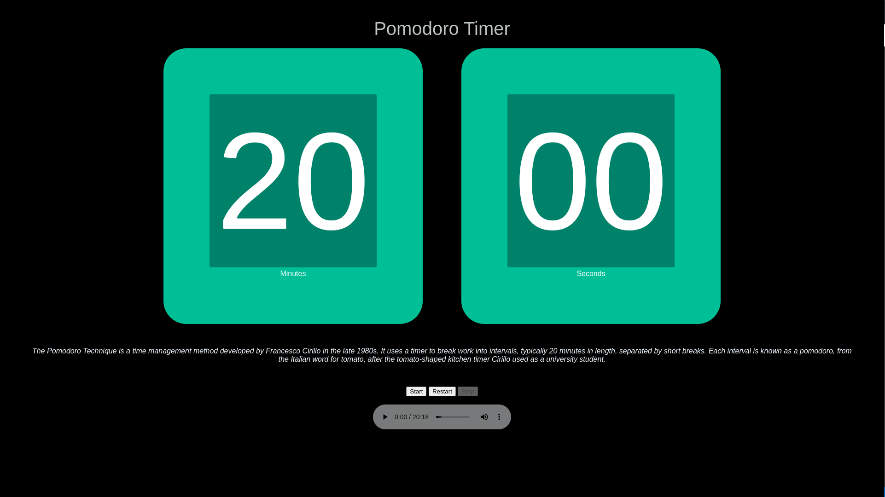

# Pomodoro
Timer Images [
The original technique has six steps:

* Decide on the task to be done.
* Set the pomodoro timer (typically for 25 minutes).But we recommend 20 minutes
* Work on the task.
* End work when the timer rings and take a short break (typically 5–10 minutes).[5]
* If you have finished fewer than three pomodoros, go back to Step 2 and repeat until you go through all three pomodoros.
* After three pomodoros are done, take the fourth pomodoro and then take a long break (typically 20 to 30 minutes). Once the long break is finished, return to step 2
